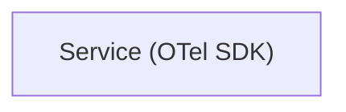
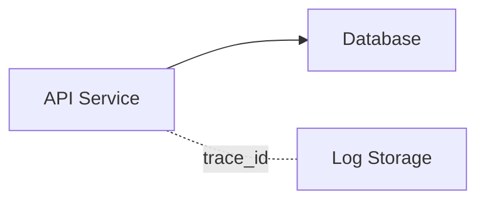
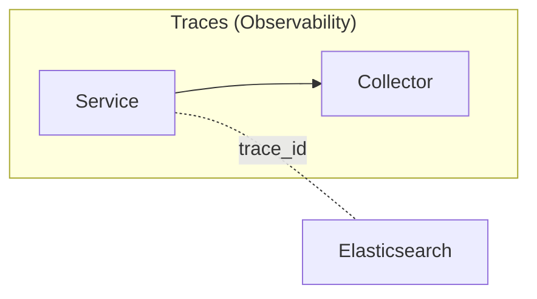
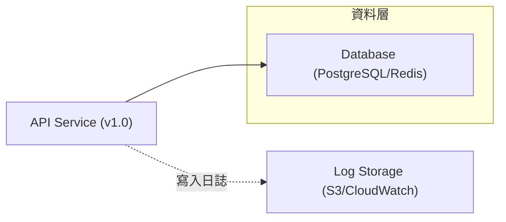

# Codex Agent Guide

本檔提供 Codex / gemini  在此專案工作的共通規範。

## 對話語言（必須遵守）

- 對話主要使用繁體中文（`zh-TW`）。

## Build and Test Commands

- 開始修改前，先檢查專案內可用的建置與測試入口，例如：`Makefile`、`justfile`、`package.json`、`pyproject.toml`、`go.mod`、`Cargo.toml`、`pom.xml`、`build.gradle`、`Taskfile.yml`。
- 優先使用專案既有指令，不要自行發明流程；若同時存在多種入口，優先使用專案文件或腳本明示的主流程。
- 先執行最小必要驗證，再依改動範圍擴大：
  - 單檔或小範圍修改：先跑最相關的 build、lint、test。
  - 共用元件、基礎設施、相依性或跨模組修改：除局部驗證外，也要跑更完整的 build 與 test。
- 若專案同時提供 `lint`、`test`、`build`，預設執行順序為：`lint` → `test` → `build`。
- 若沒有自動化測試，必須明確說明，並至少執行可用的語法檢查、型別檢查或建置檢查。
- 回報結果時，需清楚列出實際執行的命令，以及成功、失敗、略過的原因。

## Agent / 測試要求

- 執行此專案任務時，若當前 session 與上層策略允許，且使用者明確要求委派，應至少 `spawn one agent` 協助處理；若因上層限制、任務性質或使用者未要求而未委派，需在回報中說明原因。
- 任何網頁 UI、自動化驗證或手動測試流程，若當前 session 已提供 Chrome MCP，必須優先使用 Chrome MCP。
- 若當前 session 未提供 Chrome MCP，必須先在回報中明確說明，再由使用者決定是否改用其他測試方案；未經使用者同意，不得自行切換到其他瀏覽器測試方案。

## Review Expectations

- 在提交前，必須以 code review 心態重新檢查自己的修改，而不是只確認「能動」。
- 至少檢查以下項目：
  - 是否引入功能回歸、邏輯漏洞或錯誤處理缺口。
  - 是否影響相容性、部署流程、設定檔或資料格式。
  - 是否需要補測試、文件、註解、migration 或 release note。
  - 是否有安全性、權限、機敏資訊或輸入驗證風險。
  - Mermaid、Markdown 連結、範例指令是否符合本檔規範。
- 若有未完成驗證、已知風險或無法在本次處理的事項，必須明確揭露，不可省略。

## Git 工作流程

每次對專案進行修改後，agent 應該：

1. 檢視修改內容
   - 使用 `git status` 查看所有改動的檔案。
   - 使用 `git diff` 查看具體的修改內容。
   - 確認修改符合預期。
2. 進行 Commit
   - 使用 `git add` 將改動加入 staging area。
   - 使用 `git commit` 提交改動，並撰寫清楚的 commit message。
   - Commit message 應遵循慣例，例如：`feat:`、`fix:`、`test:`、`docs:`。
3. 確認狀態
   - 使用 `git status` 確認工作目錄已乾淨。
   - 可選：使用 `git log -1 --stat` 確認 commit 內容。

重要：

- 不要等待用戶提醒，在完成程式碼修改後自動執行上述 git 工作流程。
- 提交前檢查：若本次改動包含 `*.md`，必須先執行 `scripts/check-doc-ref-links.sh` 並確保通過；若未通過，需先修正後才可以 commit。
- 進入子目錄工作前，請先檢查該子目錄是否有 `AGENTS.md`，並遵循其額外指示。

## 問題紀錄規範

- 若在執行過程中遇到任何問題，必須記錄問題處理過程。
- 問題分析可視需要使用 `kubectl`、`gcloud`、`helm` 等指令輔助。
- 記錄內容必須包含：問題分析、root cause、解決方法。
- 記錄位置：最接近正在處理資料夾的 [issuelog/][issuelog]。
- 若 [issuelog/][issuelog] 不存在，必須先建立再記錄。

## Mermaid 圖表產出規範

為確保 Mermaid 圖表能正確渲染並避免 Parse Error，請嚴格遵守以下規範。

### 1. 節點標籤一律使用雙引號

若標籤中含有特殊字元、空白或括號時，必須使用雙引號；為避免漏網之魚，建議全面使用。

- 錯誤範例

```mermaid
flowchart LR
  app[Service (OTel SDK)]
```

- 正確範例



### 2. 常見需引號的字元

即使部分字元在某些狀況下可運作，仍建議使用雙引號包住整個標籤。

- 括號：`(`、`)`、`[`、`]`
- 路徑符號：`/`、`\`
- 標點符號：`.`、`,`、`...`、`:`、`&`
- 空白：任何空格

### 3. 節點語法與邊標註

- 節點定義：`ID["顯示標籤"]`
- 邊標註：`A -. "label" .- B`



### 4. 常見錯誤對照

| 問題類型 | 錯誤語法（可能導致 Parse Error） | 正確語法（建議） |
| --- | --- | --- |
| 含括號 | `svc[Service (SDK)]` | `svc["Service (SDK)"]` |
| 含斜線 | `node[Agent/Collector]` | `node["Agent/Collector"]` |
| 省略符號 | `db[Storage...]` | `db["Storage..."]` |
| 含連字號 | `ui[Web-Interface]` | `ui["Web-Interface"]` |

### 5. 子圖與標註建議

- 子圖標題若含空白或符號，請加上雙引號。
- 邊上的文字也建議以雙引號包住。



### 6. 範例（建議格式）



若不確定標籤是否安全，請一律使用雙引號。

## 文件連結規範

- `docs/` 內文件參考必須使用 Markdown reference-style links（`[文字][ref]`），並在文末提供 `[ref]: path` 定義，不可使用純文字或反引號路徑。


## Active Technologies
- TypeScript 5.x, React 19.x, Node.js 22.12+ + React 19, React DOM 19, Express 5, node-postgres (`pg`) 8.15+, Cheerio 1.1.x (001-skill-link-resolver)
- PostgreSQL 16+ (001-skill-link-resolver)

## Recent Changes
- 001-skill-link-resolver: Added TypeScript 5.x, React 19.x, Node.js 22.12+ + React 19, React DOM 19, Express 5, node-postgres (`pg`) 8.15+, Cheerio 1.1.x
